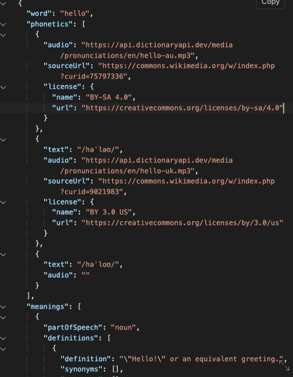
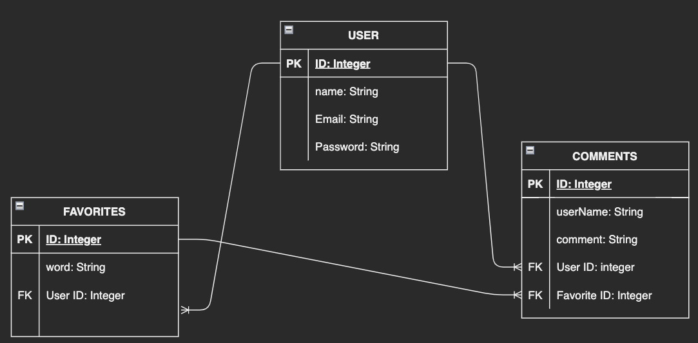
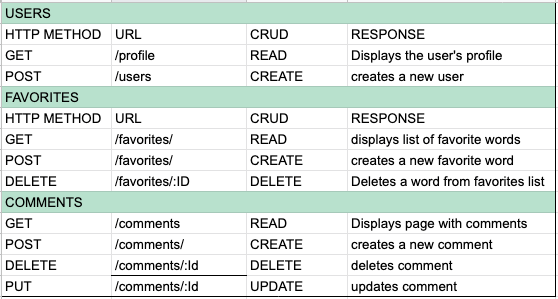
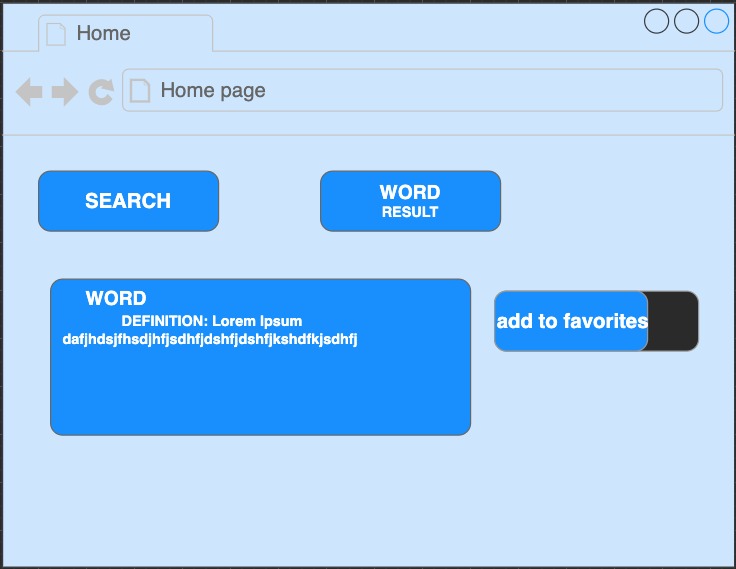
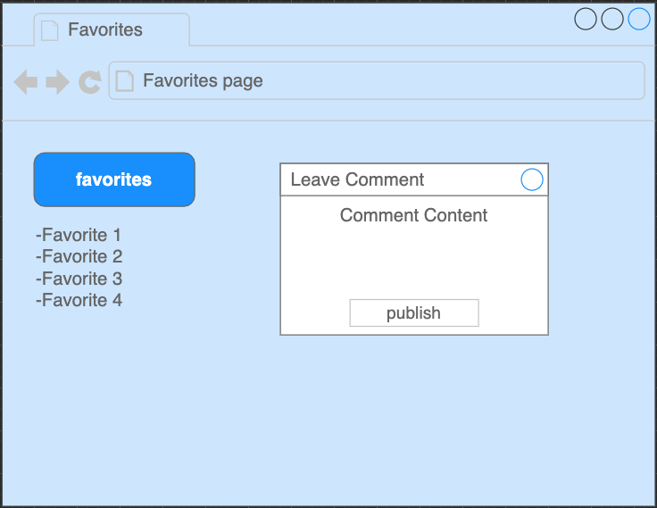

# A full stack dictionary app

This is a Dictionary app that utilizes an external API (https://dictionaryapi.dev/) to display search results for any given word. The app uses a variety of technologies, including JavaScript, CSS, HTML, Node, Postgresql, and Express, and allows users to add words to a list of favorites, view a favorites page that shows all favorite words and comments on that page, and comment on individual word pages.

## Description:

A Dictionary app that displays any word as a result of a search.

## API

https://dictionaryapi.dev/

## Link to Deployed Site
https://ject-2-test-deploy.herokuapp.com/

## ERD

## RESTful Routing Chart

## Wireframe

## Installation Instruction
- Fork and Clone repo to your local repository
- Run npm init -y to initialize npm
- Open the repo and navigate to package.json file and see a list of npm       packages listed under dependencies
- Run npm install or npm i in the terminal to download of all required npm packages. node_modules should appear in the folder.
Make sure node_modules and .env are in the gitignore file before committing to remote repository
- Run sequelize db:create to create the database in psql
- Run sequelize db:migrate to migrate the models

## Tech Used

- Javascript
- CSS
- HTML
- Node
- Axios
- Postgresql
- Sequelize
- Express
- Bcrypt
- Cookie-Parser
- Crypto-JS
- Dotenv
- EJS
- Bootstrap
- Font Awesome

## User Stories

- As a user, i want to view all information and context around my word search.
- As a user, i want to add words to a list of favorites.
- As a user, i want to view a page of all my favorites.
- As a user, i want to be able to comment on each of these pages.

## MVP Goals

- User is able to add word as a favorite.
- User is also able to comment on the page that displays definition. For example they can submit a sentence.
- User can view a favorites page that shows all favorite words and shows all comments on that page.

## Stretch Goals

- Site displays a word of the day.

## Post Project Reflection
- My key takeaway from this project is to be organized.  This is an area i see opportunity for growth in.  The approach i took was to keep the routes in one place, controllers/users in my file structure.  In hindsight i realize they should all be kept in their respective foldersand the url path would change.  ANother key takeaway is to be focused when analyzing what JSON data you want to feed your page from the api.  I overlooked an indented bracketand needed help to get the info loop renderingon my page - but in that learned a valuable lesson.  This is also possiby the last time i use bootstrap as their default classes have css built in and are very hard to override.  Had to jump through some hoops to make it look non bootstrappy.
  
